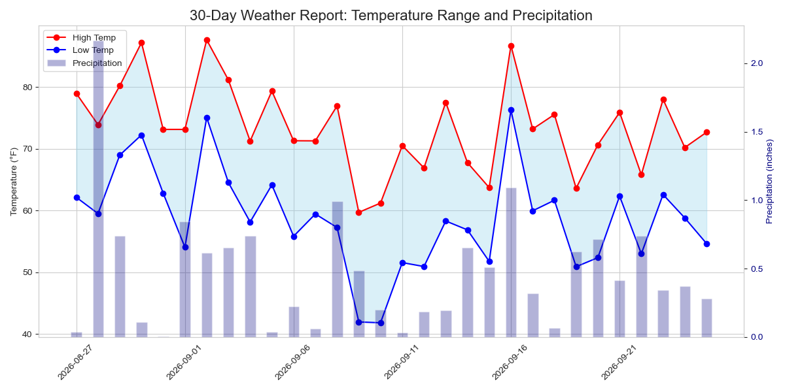

# Hello, everyone! 👋 {background-color="#1B3A6B"}

# Brief recap 📚 {background-color="#1B3A6B"}

## Where we left off
### You now have an AWS account

:::{style="margin-top: 25px; font-size: 26px;"}
:::{.columns}
:::{.column width="55%"}
- Last class: why [rent]{.alert} servers instead of buying them
- Animoto and The Washington Post showed what renting makes possible
- [IaaS, PaaS, SaaS, FaaS]{.alert} and the main AWS services
- The October 2025 `us-east-1` outage
- Your [free plan]{.alert} account and [zero-spend budget]{.alert}
- Amazon Textract on a scanned document
- So far, everything happened in the browser. [Today we use the terminal (as always!)]{.alert} 😂
:::

:::{.column width="45%"}
:::{style="text-align: center;"}
[{width="58%"}](#){data-modal-type="image" data-modal-url="figures/meme.png"}

:::{style="font-size: 17px;"}
Cartoon by [Forrest Brazeal](https://forrestbrazeal.com/)
:::
:::
:::
:::
:::

## Today's plan 

:::{style="margin-top: 30px; font-size: 24px;"}
:::{.columns}
:::{.column width="50%"}
- Launch an [EC2]{.alert} instance from the AWS console
- Connect to it with [SSH]{.alert} and a key pair
- Windows users: keep the key in [WSL]{.alert}, where `chmod` works
- Install software with `apt` and copy files with `scp`
- [Stop and terminate]{.alert} instances, so the bill stays at zero
- [CloudShell]{.alert}: a terminal in the browser, with the `aws` command line
- Activity 01: run [Jupyter]{.alert} on the instance
- Activity 02: [analyse data in the cloud]{.alert} (time permitting)
:::

:::{.column width="50%"}
:::{style="text-align: center;"}
[{width="80%"}](#){data-modal-type="image" data-modal-url="figures/ubuntu.jpg"}

[About Ubuntu (Wikipedia)](https://en.wikipedia.org/wiki/Ubuntu)

[Ubuntu (Official Site)](https://ubuntu.com/)
:::
:::
:::
:::

# EC2 from your local machine 🖥️ {background-color="#1B3A6B"}

## EC2 instances in a nutshell

:::{style="margin-top: 30px; font-size: 24px;"}
:::{.columns}
:::{.column width="50%"}
- [EC2]{.alert} is a virtual server in the cloud, usually running [Ubuntu](https://ubuntu.com/) or [Amazon Linux](https://aws.amazon.com/linux/amazon-linux-2023/)
- [Virtualisation]{.alert} runs many instances on one physical machine
  - A [virtual machine](https://www.datacamp.com/blog/what-is-a-virtual-machine) is a software copy of a computer
  - A [hypervisor](https://www.redhat.com/en/topics/virtualization/what-is-a-hypervisor) shares out the hardware between them
- [Instance types]{.alert} differ in CPU, memory, storage, and network
  - T3 and M7i are general purpose
  - C7i is compute-optimised, and R7i is memory-optimised
- Six types are [free tier eligible]{.alert}. We use `t3.micro`
:::

:::{.column width="50%"}
:::{style="text-align: center;"}
[{width="80%"}](#){data-modal-type="image" data-modal-url="figures/hypervisor.avif"}

Source: [DataCamp](https://www.datacamp.com/blog/what-is-a-virtual-machine)
:::
:::
:::
:::

## Ubuntu Linux

:::{style="margin-top: 30px; font-size: 22px;"}
:::{.columns}
:::{.column width="50%"}
- [Linux]{.alert} is an open-source operating system
- It runs most of the servers on the internet
- It is [free]{.alert} to install, and you can change any part of it
- [Ubuntu](https://ubuntu.com/) is the most widely used Linux distribution
  - It is based on [Debian](https://www.debian.org/) and built for ease of use
  - [Long-term support (LTS)](https://ubuntu.com/about/release-cycle) versions get 5 years of updates
  - It has [desktop](https://ubuntu.com/desktop) and [server](https://ubuntu.com/server) editions
- [Google](https://cloud.google.com/), [Amazon](https://aws.amazon.com/), and [Microsoft](https://azure.microsoft.com/en-us/) all offer Ubuntu instances
- [WSL](https://docs.microsoft.com/en-us/windows/wsl/) runs Linux inside Windows, Ubuntu by default
:::

:::{.column width="50%"}
:::{style="text-align: center;"}
[{width="90%"}](#){data-modal-type="image" data-modal-url="figures/ubuntu.png"}

[Ubuntu Desktop](https://ubuntu.com/desktop)
:::

- Ubuntu uses [bash]{.alert} as its default login shell
- So [the commands from the shell module work on Ubuntu]{.alert}
:::
:::
:::

## Ubuntu server

:::{style="margin-top: 30px; font-size: 23px;"}
:::{.columns}
:::{.column width="50%"}
- Ubuntu has a GUI, but we will use only the [terminal]{.alert}
- A bare-bones instance is [cheaper]{.alert} and [faster]{.alert} than a full desktop
- The terminal has [everything you need]{.alert} to manage it
- The commands are [the same]{.alert}: `ls`, `cd`, `pwd`, and so on
- `sudo` runs a command as [root]{.alert}, the superuser
- Root has full control over the system, so [be careful with it!]{.alert}
- `apt` (Advanced Package Tool) installs software
  - `apt update` refreshes the package list
  - `apt install` installs a package
:::

:::{.column width="50%"}
:::{style="text-align: center;"}
[{width="100%"}](#){data-modal-type="image" data-modal-url="figures/terminal.jpg"}

[Ubuntu Terminal](https://ubuntu.com/tutorials/command-line-for-beginners)
:::

- `sudo apt install python3` installs Python 3
- `sudo apt install python3-pip` installs [pip](https://pypi.org/project/pip/)
:::
:::
:::

## Windows Subsystem for Linux (WSL)
### A real Linux system inside Windows

:::{style="margin-top: 30px; font-size: 23px;"}
:::{.columns}
:::{.column width="50%"}
- [WSL](https://learn.microsoft.com/en-us/windows/wsl/) runs Linux inside Windows. It installs [Ubuntu]{.alert} by default
- You get the same `bash` terminal that Mac and Linux users have, so every command in this course works
- Windows runs it in a small virtual machine and starts it for you when you open the Ubuntu app
- Tutorial 06 has the installation steps. I hope many of you have done it already! 😊
- To open it, type `Ubuntu` in the Start menu
- WSL has [two separate filesystems]{.alert}:
  - Your Linux home, `/home/<your-linux-name>`, also written `~`
  - Your Windows drive `C:`, which Linux sees as `/mnt/c/`
:::

:::{.column width="50%"}
:::{style="text-align: center;"}
[{width="100%"}](#){data-modal-type="image" data-modal-url="figures/wsl.jpg"}

[Ubuntu on Windows (WSL)](https://ubuntu.com/wsl)
:::
:::
:::
:::

## WSL and your SSH key
### Move the key into your Linux home first

:::{style="margin-top: 30px; font-size: 22px;"}
:::{.columns}
:::{.column width="45%"}
- Your browser saves the key on the Windows side, in your `Downloads` folder
- From WSL, that folder is `/mnt/c/Users/<your-windows-name>/Downloads/`
- Files on the Windows drive [ignore `chmod`]{.alert}. They always look open to everyone
- SSH then refuses the key with `WARNING: UNPROTECTED PRIVATE KEY FILE!`
- The fix is to [copy the key into your Linux home]{.alert} and set its permissions there
- Not sure of your Windows user name? Run `ls /mnt/c/Users/`
- Your Linux files also appear in Windows Explorer, under `Linux` in the left panel
:::

:::{.column width="55%"}
:::{style="font-size: 20px;"}
```bash
# 1. Copy the key from Downloads to your Linux home
cp /mnt/c/Users/<your-windows-name>/Downloads/datasci350.pem ~/

# 2. Make it readable only by you
chmod 400 ~/datasci350.pem

# 3. Check: the line should start with -r--------
ls -l ~/datasci350.pem

# 4. Connect as usual
ssh -i ~/datasci350.pem ubuntu@<your-public-dns>
```
:::
:::
:::
:::

## Step 01: Launching an EC2 instance

:::{style="margin-top: 30px; font-size: 23px;"}
:::{.columns}
:::{.column width="40%"}
- Now we can launch an [EC2 instance]{.alert}!
- Sign in to the [AWS Console](https://aws.amazon.com/console/) and search for EC2
- On the EC2 Dashboard, click the orange [Launch instance]{.alert} button
- Choose an [AMI (Amazon Machine Image)](https://docs.aws.amazon.com/AWSEC2/latest/UserGuide/AMIs.html). We pick Ubuntu, which is free tier eligible
- AWS has [thousands of AMIs]{.alert}: Windows, macOS, and other Linux distributions
- Many come ready to run specific software, such as [Jupyter](https://jupyter.org/), [TensorFlow](https://www.tensorflow.org/), or [Docker](https://www.docker.com/)
:::

:::{.column width="60%"}
:::{style="text-align: center;"}
[{width="100%"}](#){data-modal-type="image" data-modal-url="figures/ec2-dashboard-2026.png"}

:::{style="font-size: 17px;"}
The [EC2 Dashboard](https://us-east-1.console.aws.amazon.com/ec2/home?region=us-east-1#Home:)
:::
:::
:::
:::
:::

## Step 02: Choosing an instance type

:::{style="margin-top: 30px; font-size: 23px;"}
:::{.columns}
:::{.column width="42%"}
- Type a name under `Name and tags`, such as `datasci350`
- Under `Application and OS Images`, choose [Ubuntu]{.alert}
- The current release is `Ubuntu Server 26.04 LTS`, marked `Free tier eligible`
- Keep `64-bit (x86)` as the architecture
- Launch [1 instance]{.alert} for now
- The `Summary` panel on the right lists every choice before you launch
- The next slide covers the instance type
- [So far, so good?]{.alert} 😊
:::

:::{.column width="58%"}
:::{style="text-align: center; margin-top: -10px;"}
[{width="100%"}](#){data-modal-type="image" data-modal-url="figures/launch-instance-2026.png"}

:::{style="font-size: 17px;"}
The [launch wizard](https://us-east-1.console.aws.amazon.com/ec2/v2/home?region=us-east-1#LaunchInstanceWizard:). Click the image to read the `Summary` panel
:::
:::
:::
:::
:::

## Which instance type is free?
### The console's own note is out of date

:::{style="margin-top: 25px; font-size: 22px;"}
:::{.columns}
:::{.column width="45%"}
- Choose [`t3.micro`]{.alert}, labelled `Free tier eligible`
- Accounts opened after 15 July 2025 can use six types: `t3.micro`, `t3.small`, `t4g.micro`, `t4g.small`, `c7i-flex.large` and `m7i-flex.large`
- The dropdown shows the price of every type
- A `t3.micro` has 2 vCPUs and 1 GiB of memory, and costs [0.0104 USD an hour]{.alert} on Linux
- You can [change the instance type later]{.alert}

:::{style="background: rgba(230, 57, 70, 0.1); padding: 15px; border-radius: 10px; font-size: 18px; margin-top: 15px;"}
The blue `Free tier` note in the `Summary` panel describes the old offer: 750 hours a month of `t2.micro` for a year. That offer ended for accounts opened after [15 July 2025]{.alert}. Your account runs on credits, and `t2.micro` is not on your list
:::
:::

:::{.column width="55%"}
:::{style="text-align: center;"}
[{width="100%"}](#){data-modal-type="image" data-modal-url="figures/instance-type-2026.png"}

:::{style="font-size: 17px;"}
The instance type dropdown, with the hourly price under every entry
:::
:::
:::
:::
:::

## Step 03: Choose an SSH key pair 

:::{style="margin-top: 30px; font-size: 23px;"}
:::{.columns}
:::{.column width="40%"}
- Next, choose a [key pair]{.alert}
- A key pair is two cryptographic keys that [authenticate]{.alert} you to an instance
- You [create it once](https://docs.aws.amazon.com/AWSEC2/latest/UserGuide/ec2-key-pairs.html) and [use it for all your instances]{.alert}
- Click `Create a new key pair` and name it, e.g. `datasci350`
- Choose `ED25519` and the `.pem` file format
- Click `Create key pair` and [save the file somewhere safe]{.alert}
- You need it to log in over SSH, and [AWS cannot send you another copy]{.alert}
:::

:::{.column width="60%"}
:::{style="margin-top: -30px; text-align: center;"}
[{width="88%"}](#){data-modal-type="image" data-modal-url="figures/key-pair-2026.png"}
:::
:::
:::
:::

## Step 04: Check HTTP/HTTPS options

:::{style="margin-top: 30px; font-size: 23px;"}
:::{.columns}
:::{.column width="40%"}
- Under `Network settings`, tick `Allow HTTPS traffic` and `Allow HTTP traffic` from the internet
- This lets you reach web servers on your instance
- SSH (port 22) is open by default
- We open these ports to anyone for now
- In production, [allow only what you need]{.alert}
- Why? [Security]{.alert}! Every open port is a way in for attackers
- You can [edit the security group later]{.alert}
:::

:::{.column width="60%"}
:::{style="text-align: center;"}
[{width="100%"}](#){data-modal-type="image" data-modal-url="figures/security-group.png"}
:::
:::
:::
:::

## Step 05: Configure storage

:::{style="margin-top: 30px; font-size: 22px;"}
:::{.columns}
:::{.column width="40%"}
- Under `Configure storage`, you can resize the `Root` volume
- The default [8 GB]{.alert} is enough for today. A larger disk spends more credits
- You can add more volumes if you need them
- `gp3` is the default type and works for most uses
- `io2` is the fastest and most expensive, for databases that need sub-millisecond latency
- `sc1` and `st1` are cheaper hard-disk types for rarely used data. They cannot be the root disk
:::

:::{.column width="60%"}
:::{style="text-align: center;"}
[{width="100%"}](#){data-modal-type="image" data-modal-url="figures/storage.png"}
:::

- [Now you just have to click on `Launch instance`]{.alert}! 🚀

:::{style="text-align: center;"}
[{width="90%"}](#){data-modal-type="image" data-modal-url="figures/launch.png"}
:::
:::
:::
:::

## Step 06: Log in to the EC2 instance through SSH

:::{style="margin-top: 30px; font-size: 22px;"}
:::{.columns}
:::{.column width="50%"}
- After you click `Launch instance`, open the Instances page
- Click `Connect to instance` to see the instructions

:::{style="text-align: center;"}
[{width="100%"}](#){data-modal-type="image" data-modal-url="figures/connect.png"}
:::
:::

:::{.column width="50%"}
- Choose the [`SSH client`]{.alert} tab
- [Open a terminal]{.alert} in the folder where you saved the key
- The console writes both commands for you under `How to connect`:
  - Step 3: `chmod 400 "your-key.pem"`
  - Step 4: `ssh -i "your-key.pem" ubuntu@your-public-dns`

:::{style="text-align: center;"}
[{width="100%"}](#){data-modal-type="image" data-modal-url="figures/connect-ssh-2026.png"}
:::
:::
:::
:::

## And you are in! 🎉
### Welcome to the cloud! 🌥️

:::{style="margin-top: 30px; font-size: 24px;"}
:::{.columns}
:::{.column width="58%"}
:::{style="text-align: center; margin-top: -20px;"}
[{width="100%"}](#){data-modal-type="image" data-modal-url="figures/ssh-session-2026.png"}
:::
:::

:::{.column width="42%"}
- The first connection asks you to confirm the host fingerprint
- Type `yes` once, and SSH remembers the machine
- The banner shows what you rented: [Ubuntu 26.04 LTS]{.alert}, a 6.61 GB disk that is 30% full, 118 processes, and no other users
- The prompt changes to `ubuntu@ip-172-31-13-146`
- Every command now runs on a computer in [Virginia]{.alert}
- `exit` [logs you out and returns you to your own machine]{.alert}
:::
:::
:::

## Check the instance details on the AWS Console

:::{style="margin-top: 30px; font-size: 24px;"}
:::{.columns}
:::{.column width="30%"}
- Click the instance ID, or `Instances` on the left
- You can see its [public IP address]{.alert}, [instance type]{.alert}, [security group]{.alert}, and [key pair]{.alert}
- You can also [stop]{.alert}, [terminate]{.alert}, or [reboot]{.alert} it here (more on this later)
:::

:::{.column width="70%"}
:::{style="text-align: center;"}
[{width="100%"}](#){data-modal-type="image" data-modal-url="figures/instance-details-2026.png"}
:::
:::
:::
:::

## AWS CloudShell
### A terminal in the browser, already signed in

:::{style="margin-top: 30px; font-size: 22px;"}
:::{.columns}
:::{.column width="46%"}
- Open it from the [bottom left]{.alert} of the console. Nothing to install
- [Amazon Linux 2023]{.alert}: 1 vCPU, 2 GiB of RAM, 1 GB of saved storage
- Free: you pay only for the resources you use from it
- The [AWS CLI]{.alert} is already signed in as you
- Also there: `git`, `python3`, `pip`, `boto3`, `jq`, `wget`, `ssh`, `vim`, `nano`, `tmux`
- It runs [bash]{.alert}, so your usual commands work
- Sessions end after 20 to 30 idle minutes, or 12 hours
- Unused home directories are deleted after 120 days
:::

:::{.column width="54%"}
:::{style="text-align: center;"}
[{width="100%"}](#){data-modal-type="image" data-modal-url="figures/cloudshell-open-2026.png"}

:::{style="font-size: 17px;"}
The panel you meet on first launch, stating the tools and the 1 GB of storage per region
:::
:::

- I recommend [your local terminal and editor]{.alert}. Use CloudShell as a fallback
:::
:::
:::

## CloudShell commands
### What is actually new

:::{style="margin-top: 25px; font-size: 20px;"}
:::{.columns}
:::{.column width="52%"}
The shell commands work as usual. What is new is the `aws` command line, [already signed in as you]{.alert}:

:::{style="text-align: center; margin-top: 30px; margin-bottom: 30px; font-size: 19px;"}
| Command | What it does |
|---|---|
| `aws sts get-caller-identity` | Prints which account and user you are signed in as |
| `aws ec2 describe-instances --output table` | Lists your instances without leaving the browser |
| `aws ec2 stop-instances --instance-ids i-...` | Stops an instance from the command line |
| `aws s3 ls` | Lists your S3 buckets |
| `aws s3 cp report.pdf s3://my-bucket/` | Copies a file into a bucket |
| `sudo dnf install <package>` | Installs software for this session only |
:::

- Amazon Linux uses [`dnf`]{.alert} where Ubuntu uses `apt`
- Software installed with `dnf` goes to `/usr/bin`, which is wiped when the session ends
- Keep anything you need in your home directory
:::

:::{.column width="48%"}
:::{style="text-align: center;"}
[{width="100%"}](#){data-modal-type="image" data-modal-url="figures/cloudshell-cli-2026.png"}
:::

:::{style="font-size: 17px;"}
Two `aws` commands and what they return. The account number is blanked out, and `describe-instances` reports one machine running and one already terminated. [More commands here](https://docs.aws.amazon.com/cloudshell/latest/userguide/getting-started.html)
:::
:::
:::
:::

## CloudShell as a way back in
### When your own terminal will not cooperate

:::{style="margin-top: 20px; font-size: 19px;"}
:::{.columns}
:::{.column width="42%"}
:::{style="font-size: 23px;"}
- The [WSL problem]{.alert}: Windows ignores `chmod 400` on files in the Windows filesystem, so SSH refuses the key
- CloudShell avoids this, because the key goes to a Linux machine:

1. Open CloudShell from the console.
2. Choose `Actions`, then `Upload file`.
3. Select your `.pem` file. It arrives in `/home/cloudshell-user`.
4. Run `chmod 400 your-key.pem`.
5. Run the same `ssh -i ...` command the console gave you.

- The instance does not care that the connection came from a browser tab
:::
:::

:::{.column width="58%"}
:::{style="text-align: center;"}
[{width="18%"}](#){data-modal-type="image" data-modal-url="figures/cloudshell-actions-2026.png"}

[{width="92%"}](#){data-modal-type="image" data-modal-url="figures/cloudshell-ssh-2026.png"}

:::{style="font-size: 17px;"}
The whole thing from a browser tab: the upload confirmation, `chmod 400`, and an Ubuntu 26.04 prompt on the instance
:::
:::

- CloudShell times out after [20 to 30 idle minutes]{.alert}, and your SSH connection goes with it
:::
:::
:::

## Step 07: Update and install software

:::{style="margin-top: 30px; font-size: 22px;"}
:::{.columns}
:::{.column width="40%"}
- First, refresh the package list: `sudo apt update`
- Then install the latest updates: `sudo apt upgrade`
  - `-y` answers `yes` to every prompt: `sudo apt update && sudo apt upgrade -y`
- Install software with `sudo apt install`
  - Python 3: `sudo apt install python3`
  - pip: `sudo apt install python3-pip`
- You can install [Jupyter](https://jupyter.org/) and anything else the same way
:::

:::{.column width="60%"}
:::{style="text-align: center;"}
[{width="100%"}](#){data-modal-type="image" data-modal-url="figures/update.png"}

`sudo apt update && sudo apt upgrade -y && sudo apt install -y python3 python3-pip`
:::

:::{style="background: rgba(230, 57, 70, 0.1); padding: 15px; border-radius: 10px; font-size: 19px; margin-top: 15px;"}
`pip install` gives an `externally-managed-environment` error on Ubuntu. Use `sudo apt install python3-<package>` or a virtual environment
:::
:::
:::
:::

## Adding files to your instance

:::{style="margin-top: 25px; font-size: 21px;"}
:::{.columns}
:::{.column width="42%"}
- `scp` means "secure copy". It moves files over SSH
- `-i` stands for "identity file", your key
- [The first path is the source]{.alert}, and the second is the destination

```verbatim
# laptop to instance
scp -i key.pem myfile ubuntu@public-dns:~

# instance to laptop
scp -i key.pem ubuntu@public-dns:~/myfile .
```

- The `.` in the second command means "the folder I am in now"
- `scp` can also copy [between two remote servers]{.alert}
- [Windows users]{.alert}: [WinSCP](https://winscp.net/eng/index.php) and [PuTTY](https://www.chiark.greenend.org.uk/~sgtatham/putty/) do the same with a drag-and-drop window
:::

:::{.column width="58%"}
- Open a [new local terminal]{.alert}. [`scp` runs on your own machine]{.alert}, not on the instance:

:::{style="font-size: 19px;"}
```verbatim
echo 'print("Hello, DATASCI350!")' > hello.py
scp -i datasci350.pem hello.py ubuntu@XXXXXX.compute-1.amazonaws.com:~
```
:::

:::{style="text-align: center;"}
[{width="100%"}](#){data-modal-type="image" data-modal-url="figures/scp.png"}
:::

- Replace `XXXXXX` with your public DNS, from the Instances page
- [Keep the `:~` at the end]{.alert}. It means the home directory
- In your SSH session, `ls` shows the file and `python3 hello.py` runs it

:::{style="text-align: center; margin-top: -20px;"}
[{width="58%"}](#){data-modal-type="image" data-modal-url="figures/hello.png"}
:::
:::
:::
:::

## Stopping and terminating your instance

:::{style="margin-top: 25px; font-size: 24px;"}
:::{.columns}
:::{.column width="40%"}
- [Stop or terminate]{.alert} instances you are not using
- [Stop]{.alert} pauses it. Compute is not charged, but the disk still is
- [Terminate]{.alert} deletes it, with every file on it
- A restarted instance gets a [new IP address]{.alert}, so your old `ssh` command stops working
- A `t3.micro` left on for a month costs [about $12]{.alert}: $7.60 compute, $3.65 IP address, $0.64 disk
- Stop, terminate, or reboot from the [Instances page]{.alert}
- Let's [terminate]{.alert} ours now! 🛑
:::

:::{.column width="60%"}
:::{style="text-align: center;"}
[{width="100%"}](#){data-modal-type="image" data-modal-url="figures/stop-2026.png"}

:::{style="font-size: 17px;"}
The `Instance state` menu. `Terminate (delete) instance` is the last entry
:::

[{width="100%"}](#){data-modal-type="image" data-modal-url="figures/terminated-2026.png"}

:::{style="font-size: 17px;"}
Afterwards both instances read `Terminated`, and the `Public IPv4 DNS` column is empty. The address is gone
:::
:::
:::
:::
:::

# Now it is your turn! 🚀 {background-color="#1B3A6B"}

## Activity 01

:::{style="margin-top: 20px; font-size: 21px;"}
:::{.columns}
:::{.column width="50%"}
1. Launch an EC2 instance called `jupyter`
2. Connect [with port forwarding]{.alert}:
    - `ssh -i "<your-key>.pem" ubuntu@<public-DNS> -L 8000:localhost:8888`
    - This forwards port 8888 on the instance to port 8000 on your laptop
3. Install Python, pip, and Jupyter:
    - `sudo apt update && sudo apt upgrade -y`
    - `sudo apt install -y python3 python3-pip jupyter-notebook`
    - Note the hyphen in [`jupyter-notebook`]{.alert}. `python3-notebook` installs only the library, without the `jupyter` command
4. Check: `which python3`, `which pip3`, `which jupyter`
:::

:::{.column width="50%"}
5. Start Jupyter: `jupyter notebook`
6. Open `http://localhost:8000` and paste the token from the terminal
    - Or click the terminal link (`http://localhost:8888/?token=...`) and change `8888` to `8000`
7. Create a notebook and run `print('Hello, DATASCI350!')`
8. [Do not]{.alert} terminate the instance yet. We use it again later

:::{style="background: rgba(27, 58, 107, 0.08); padding: 15px; border-radius: 10px; font-size: 19px; margin-top: 20px;"}
Closing SSH stops Jupyter. `tmux` keeps a session alive after you disconnect, and `tmux attach` brings you back to it. The instance bills while it runs. [More on tmux here](https://linuxize.com/post/getting-started-with-tmux/)
:::
:::
:::
:::

## Activity 01

:::{style="text-align: center; margin-top: 30px;"} 
[{width="85%"}](#){data-modal-type="image" data-modal-url="figures/jupyter.png"}
:::

## Activity 01

:::{style="margin-top: 30px; font-size: 23px; text-align: center;"}
[{width="100%"}](#){data-modal-type="image" data-modal-url="figures/hello-jupyter.png"}
:::

# Another one? 🚀 {background-color="#1B3A6B"}

## Activity 02

:::{style="margin-top: 30px; font-size: 21px;"}
- Now let's analyse some data on the instance
- We practise [two ways]{.alert} to get files onto it:
  - [Method 1, `scp`]{.alert}: upload a file from your computer. Use it for files that are not online, such as your own data or private code
  - [Method 2, `wget`]{.alert}: download a file from the internet straight to the instance, such as a file on GitHub. It skips your computer
- First, install the packages on your instance:
  - `sudo apt install -y python3-numpy python3-pandas python3-matplotlib python3-seaborn`

- [Method 1: `scp`]{.alert}. On your [local machine]{.alert}, create a weather dataset with this code, or download [weather_data.py](https://github.com/danilofreire/datasci350/blob/main/lectures/lecture-17/weather_data.py)

```python
# weather_data.py
import pandas as pd
import numpy as np
import datetime

# Set seed for reproducibility
np.random.seed(42)

# Generate dates for the past 30 days
dates = pd.date_range(end=datetime.datetime.now(), periods=30).tolist()
dates = [d.strftime('%Y-%m-%d') for d in dates]

# Generate temperature data with some randomness
temp_high = np.random.normal(75, 8, 30)
temp_low = temp_high - np.random.uniform(10, 20, 30)
precipitation = np.random.exponential(0.5, 30)
humidity = np.random.normal(65, 10, 30)

# Create a structured dataset
weather_data = pd.DataFrame({
    'date': dates,
    'temp_high': temp_high,
    'temp_low': temp_low,
    'precipitation': precipitation,
    'humidity': humidity
})

# Save to a text file
with open('weather_data.txt', 'w') as f:
    f.write("# Weather data for the past 30 days\n")
    f.write(weather_data.to_string(index=False))
    
print("Weather data saved to weather_data.txt")
```
:::

## Activity 02

:::{style="margin-top: 30px; font-size: 22px;"}
- Run the script on your [local machine]{.alert}: `python3 weather_data.py`
- It creates `weather_data.txt` with 30 days of weather data
- Upload it to your instance with `scp`, from a [local terminal]{.alert}:
  - `scp -i <your-key>.pem weather_data.txt ubuntu@<your-instance-ip>:~/`
- Run `ls` on the instance to check that it arrived

- [Method 2: `wget`]{.alert}. Download the analysis script [straight to the instance]{.alert}. Run this on your [EC2 instance]{.alert}:

:::{style="font-size: 20px;"}
- `wget https://raw.githubusercontent.com/danilofreire/datasci350/main/lectures/lecture-17/weather_analysis.py` (one line)
:::

- The code is below for reference. You do not need to copy it, because `wget` already downloaded it

```python
# weather_analysis.py
import pandas as pd
import matplotlib.pyplot as plt
import seaborn as sns
from io import StringIO

# Read the weather data
with open('weather_data.txt', 'r') as f:
    lines = f.readlines()

# Skip the header comment
data_str = ''.join(lines[1:])
df = pd.read_csv(StringIO(data_str), sep=r'\s+')

# Print basic statistics
print("Weather Data Analysis:")
print("=====================")
print(f"Number of days: {len(df)}")
print(f"Average high temperature: {df['temp_high'].mean():.1f}°F")
print(f"Average low temperature: {df['temp_low'].mean():.1f}°F")
print(f"Maximum temperature: {df['temp_high'].max():.1f}°F on {df.loc[df['temp_high'].idxmax(), 'date']}")
print(f"Minimum temperature: {df['temp_low'].min():.1f}°F on {df.loc[df['temp_low'].idxmin(), 'date']}")
print(f"Days with precipitation > 1 inch: {len(df[df['precipitation'] > 1])}")

# Create a visualisation
sns.set_style("whitegrid")
fig, ax1 = plt.subplots(figsize=(12, 6))

# Plot temperature range on the left axis
ax1.fill_between(df['date'], df['temp_low'], df['temp_high'], alpha=0.3, color='skyblue')
ax1.plot(df['date'], df['temp_high'], marker='o', color='red', label='High Temp')
ax1.plot(df['date'], df['temp_low'], marker='o', color='blue', label='Low Temp')
ax1.set_ylabel('Temperature (°F)')

# Add precipitation as bars on a second axis, on the right
ax2 = ax1.twinx()
ax2.bar(df['date'], df['precipitation'], alpha=0.3, color='navy', width=0.5, label='Precipitation')
ax2.set_ylabel('Precipitation (inches)', color='navy')
ax2.tick_params(axis='y', labelcolor='navy')
ax2.grid(False)

# One legend for both axes, and every fifth date on the x-axis
lines1, labels1 = ax1.get_legend_handles_labels()
lines2, labels2 = ax2.get_legend_handles_labels()
ax1.legend(lines1 + lines2, labels1 + labels2, loc='upper left')
ax1.set_xticks(df['date'][::5])
ax1.tick_params(axis='x', labelrotation=45)
ax1.set_title('30-Day Weather Report: Temperature Range and Precipitation', fontsize=16)
fig.tight_layout()

# Save the figure
fig.savefig('weather_analysis.png')
print("Analysis complete. Results saved to 'weather_analysis.png'")
```
:::

## Activity 02

:::{style="margin-top: 30px; font-size: 24px;"}
- Both files are now on your instance: `weather_data.txt` (via `scp`) and `weather_analysis.py` (via `wget`)
- Run the analysis: `python3 weather_analysis.py`, or run it in Jupyter
- Download the image to your [local machine]{.alert} with `scp`, from a local terminal:
  - `scp -i <your-key>.pem ubuntu@<your-instance-ip>:~/weather_analysis.png ./`
- Open the image on your laptop
- [Don't forget to terminate your instance when done!]{.alert}

:::{style="margin-top: 15px; background: rgba(45, 69, 99, 0.1); padding: 15px; border-radius: 10px;"}
[Recap]{.alert}: `scp` moves files between your computer and the instance. `wget` downloads files from the internet straight to the instance
:::
:::

## Activity 02 Result

:::{style="margin-top: 20px; font-size: 21px;"}
When you run the activity, you should get a graph like this one:

:::{style="text-align: center;"}
[{width="80%"}](#){data-modal-type="image" data-modal-url="figures/weather_analysis.png"}
:::
:::

## Activity 02 Result

:::{style="margin-top: 20px; font-size: 27px;"}
You've just completed a full data analysis workflow in the cloud 🎉

1. Created data locally
2. Uploaded it to the cloud
3. Processed it on a cloud server
4. Generated visualisations
5. Downloaded results to your local machine

Data scientists use this same workflow for larger datasets and more complex analyses!
:::

# Conclusion {background-color="#1B3A6B"}

## Summary
### What we learned today

:::{style="margin-top: 25px; font-size: 26px;"}
:::{.columns}
:::{.column width="50%"}
- We launched an [EC2]{.alert} instance and connected over [SSH]{.alert} with a key pair
- We installed software with `apt` and ran [Jupyter]{.alert} through a forwarded port
- We moved files with [`scp`]{.alert} and [`wget`]{.alert}
- We met [CloudShell]{.alert} and the `aws` command line
- We learnt to [stop and terminate]{.alert} instances, to keep the bill at zero
:::

:::{.column width="50%"}
- [Lambda](https://aws.amazon.com/lambda/) runs a function with no server to manage. It is the easiest service to try next
- [S3](https://aws.amazon.com/s3/), [RDS](https://aws.amazon.com/rds/), and [SageMaker](https://aws.amazon.com/sagemaker/) cover files, databases, and machine learning
- The same workflow works for data too big for a laptop: upload it, rent a machine, run the code, and download the results
:::
:::
:::

## Next class
### Getting data from the web

:::{style="margin-top: 25px; font-size: 22px;"}
:::{.columns}
:::{.column width="52%"}
- We leave the cloud and look at how data gets from the internet into your analysis
- [What an API is]{.alert}, with a client and a server on either side
- [HTTP]{.alert}: URLs, query strings, `GET` and `POST`, and status codes
- [JSON]{.alert}, the format most APIs answer in, and how it maps to a Python dictionary
- [`requests`]{.alert}, the library that does all this in three lines of code
- You have done this before: the API key in your `.env` file in Lecture 14 was for an API
:::

:::{.column width="48%"}
:::{style="margin-top: -20px;"}
Before then:

1. Terminate every instance you started today
2. Open [Billing and Cost Management](https://console.aws.amazon.com/billing/home) and check that the total is zero
3. Read the final project instructions here: <https://github.com/danilofreire/datasci350/blob/main/project/project-instructions.pdf>

:::{style="background: rgba(27, 58, 107, 0.08); padding: 15px; border-radius: 10px; font-size: 19px; margin-top: 15px;"}
The final project is out. Groups of three to four, due 8 December 2026. You pull data from a web API (the World Bank by default, or another one you clear with me) and submit everything as a Docker container. Start from the starter repository: <https://github.com/danilofreire/datasci350-project-starter>
:::
:::
:::
:::
:::

# And that's all for today! 🎉 {background-color="#1B3A6B"}