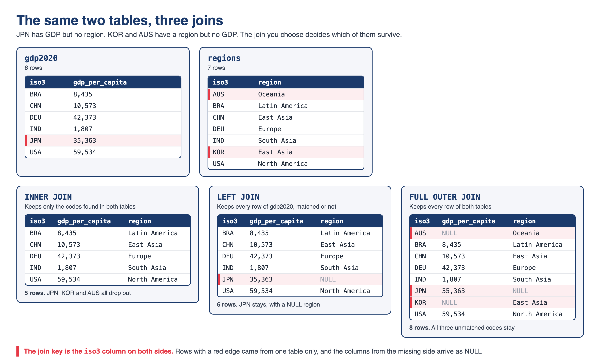

# Hello, everyone! 😊 {background-color="#1B3A6B"}

## Where we are
### The last class before the quiz and the project

:::{style="margin-top: 30px; font-size: 22px;"}
:::{.columns}
:::{.column width="52%"}
- The eight modules so far:
  - [Introduction]{.alert}: how a computer stores and runs your code
  - [Command line and version control]{.alert}: Bash, Git, GitHub
  - [Reproducible research]{.alert}: Quarto and project structure
  - [AI-assisted programming]{.alert}: local models, APIs, RAG
  - [Cloud computing]{.alert}: EC2, S3, and a bill you control
  - [Getting data from the web]{.alert}: APIs, JSON, a saved snapshot
  - [Scaling and performance]{.alert}: joblib, Dask, DuckDB
  - [Containers]{.alert}: environments and Docker
:::

:::{.column width="48%"}
- Today we revise the last two modules
- [Quiz 05]{.alert} covers Lectures 21, 22, 23 and 25
- The [final project]{.alert} is due on the last day of class, and it must render inside a container

:::{style="text-align: center; margin-top: 10px;"}
[{width="66%"}](#){data-modal-type="image" data-modal-url="figures/table-reproducibility.jpg"}

:::{style="font-size: 17px;"}
Source: [The Turing Way Community (2025)](https://book.the-turing-way.org/reproducible-research/overview/overview-definitions)
:::
:::
:::
:::
:::

## Lecture overview
### What we will cover today

:::{style="margin-top: 40px; font-size: 24px;"}
:::{.columns}
::::{.column width="50%"}
[1. Scaling and performance]{.alert}

- Parallel tools, Big O and Amdahl, the GIL, Dask

[2. SQL revision]{.alert}

- The query order, `WHERE` and `HAVING`, `COUNT`, joins

[3. SQL practice]{.alert}

- Two exercises, about ten minutes
::::

::::{.column width="50%"}
[4. Containers]{.alert}

- Pinning an environment
- The project Dockerfile, and running it
- The project checklist

[5. Quiz 05 preparation]{.alert}

- What each lecture brings, and five Dockerfile questions
::::
:::
:::

# Scaling and performance ⚡ {background-color="#1B3A6B"}

## Parallel work and its tools
### Lecture 21: `map`, `joblib` and `concurrent.futures`

:::{style="margin-top: 30px; font-size: 22px;"}
:::{.columns}
:::{.column width="52%"}
- [Serial]{.alert}: one line after another
- [Parallel]{.alert}: independent tasks at the same time, on several cores
- [Embarrassingly parallel]{.alert}: the tasks share nothing and need no result from each other
- Before parallelising, ask: are the tasks independent? Is each one big enough to be worth a worker?

:::{style="font-size: 20px;"}
```python
from joblib import Parallel, delayed

def bar(x):
    return x * x

Parallel(n_jobs=-1)(delayed(bar)(x) for x in range(6))
# [0, 1, 4, 9, 16, 25]
```
:::

- Four calls in parallel never reach a full 4×: starting workers takes time
:::

:::{.column width="48%"}
:::{style="text-align: center; font-size: 20px; margin-top: 10px; margin-bottom: 25px;"}
| Your task | Tool |
|---|---|
| Number crunching | `ProcessPoolExecutor` |
| Downloading many URLs | `ThreadPoolExecutor` |
| sklearn, numeric loops | `joblib` (`n_jobs=-1`) |
| Bigger than RAM | Dask |
:::

- [CPU-bound]{.alert}: the processor is busy, so use processes
- [I/O-bound]{.alert}: the program waits for the network or disk, so use threads
- `concurrent.futures` ships with Python, so it works where you cannot install anything
:::
:::
:::

## Big O and Amdahl's law
### What parallelism can and cannot fix

:::{style="margin-top: 30px; font-size: 22px;"}
:::{.columns}
:::{.column width="50%"}
- [Big O]{.alert}: how the runtime grows with the input size `n`
- [O(1)]{.alert}, [O(n)]{.alert}, [O(n²)]{.alert}: doubling `n` costs nothing, twice as much, or four times as much
- `p` cores turn O(n) into O(n/p + overhead). The class stays the same
- O(n log n) beats a parallel O(n²) on large inputs
- Poor candidates for parallelism:
  - Steps that need the result of the step before
  - Tasks that share a variable, like a running total
  - Tasks limited by the disk or memory
:::

:::{.column width="50%"}
- [Amdahl's law]{.alert}: the serial share $s$ limits the speed-up
- $\text{speedup} = \dfrac{1}{s + p/N}$, with $p = 1 - s$ and $N$ cores
- 90% parallel on 8 cores:

:::{style="font-size: 22px;"}
```text
1 / (0.1 + 0.9/8)
  = 1 / 0.2125
  = 4.7x
```
:::

- The ceiling is $1/s$: 10× here, and 2× for a program that is 50% serial
- Expect this arithmetic in the quiz
:::
:::
:::

## The GIL
### Why one thread runs Python at a time

:::{style="margin-top: 30px; font-size: 22px;"}
:::{.columns}
:::{.column width="52%"}
- CPython has a [Global Interpreter Lock]{.alert}: one thread runs Python at a time
- Threads help when code [waits]{.alert}: the lock is released during downloads
- Threads do not help when code [computes]{.alert}
- For computing, use [processes]{.alert}, each with its own lock
- NumPy and DuckDB [release the GIL]{.alert} in their C and C++ code
- Python 3.14 has an official [free-threaded build]{.alert}, but not by default
:::

:::{.column width="48%"}
:::{style="font-size: 20px;"}
```python
# CPU-bound: threads share one lock,
# so the time barely changes
with ThreadPoolExecutor(4) as ex:
    list(ex.map(calculation, chunks))

# Processes: four interpreters,
# four locks, four cores
with ProcessPoolExecutor(4) as ex:
    list(ex.map(calculation, chunks))
```
:::

- Swap `calculation` for a download, and the threads win
- Expect a question on which pool fits which task
:::
:::
:::

## Dask, and which tool when
### Lazy evaluation and the 200-million-row benchmark

:::{style="margin-top: 30px; font-size: 21px;"}
:::{.columns}
:::{.column width="50%"}
- [Dask]{.alert} gives lazy versions of NumPy arrays, pandas DataFrames, and your own functions (`delayed`)
- [Lazy]{.alert}: nothing runs until `.compute()`. Until then, Dask builds a task graph
- `.persist()` keeps a small result in memory
- Dask [chunks the data]{.alert}, so it can be bigger than your RAM
- The [dashboard]{.alert} at `localhost:8787` shows the tasks live
- On data that fits in memory, Dask can be slower than pandas
- Parquet cut our January 2000 data from 182 MB to 86 MB
:::

:::{.column width="50%"}
- Mean `value` by indicator and decade, on [200,681,600 rows]{.alert}, Apple M5 laptop:

:::{style="text-align: center; font-size: 22px; margin-top: 10px; margin-bottom: 20px;"}
| pandas | Dask | DuckDB |
|---|---|---|
| 9.65 s | 5.39 s | 0.53 s |
:::

- DuckDB reads only the columns it needs, and uses every core

:::{style="text-align: center; font-size: 20px; margin-top: 15px;"}
| Your situation | Reach for |
|---|---|
| Fits in RAM, exploring, plotting | pandas |
| One large file on one machine | DuckDB |
| Bigger than the machine, or a cluster | Dask |
:::
:::
:::
:::

# SQL revision 🦆 {background-color="#1B3A6B"}

## How a query runs
### And why `WHERE` and `HAVING` differ

:::{style="margin-top: 30px; font-size: 20px;"}
:::{.columns}
:::{.column width="50%"}
:::{style="text-align: center;"}
[{width="100%"}](#){data-modal-type="image" data-modal-url="figures/sql-evaluation-order.png"}
:::

- You write `SELECT` first, but the engine runs it fifth
- [`WHERE`]{.alert} filters rows before grouping. [`HAVING`]{.alert} filters groups after
- So no aggregate can go in `WHERE`: the groups do not exist yet
- Every `SELECT` column is in `GROUP BY` or inside an aggregate
- DuckDB accepts a `SELECT` alias in `WHERE`, but PostgreSQL does not
:::

:::{.column width="50%"}
:::{style="font-size: 22px;"}
```sql
SELECT country,
       ROUND(AVG(value), 0) AS mean_gdp
FROM wdi
WHERE indicator = 'gdp_per_capita'
  AND year >= 2010
GROUP BY country
HAVING AVG(value) > 60000
ORDER BY mean_gdp DESC
LIMIT 5
```
:::

- `WHERE year >= 2010` drops old rows
- `HAVING AVG(value) > 60000` drops poorer countries
- Monaco, Liechtenstein and Bermuda top the list, all with fewer than 100,000 people
:::
:::
:::

## COUNT(\*) and COUNT(value)
### Counting rows and counting values

:::{style="margin-top: 30px; font-size: 22px;"}
:::{.columns}
:::{.column width="50%"}
- [`COUNT(*)`]{.alert} counts rows. [`COUNT(value)`]{.alert} counts rows with a value
- The difference is the number of missing values
- `AVG`, `SUM`, `MIN` and `MAX` skip missing values without warning
- GDP in 2020: 217 rows, but only 208 numbers
- `primary_enrolment_net` in 2020: 217 rows and no numbers, so `AVG` is NULL
:::

:::{.column width="50%"}
:::{style="font-size: 22px;"}
```sql
SELECT year,
       COUNT(*) AS n_rows,
       COUNT(value) AS with_value,
       COUNT(*) - COUNT(value) AS missing
FROM wdi
WHERE indicator = 'internet_users_pct'
  AND year IN (1990, 2000, 2020)
GROUP BY year
ORDER BY year
```
:::

- Missing: 9 in 1990, 21 in 2000, 33 in 2020. Coverage gets [worse]{.alert}
- 26 countries with a 1990 figure have none for 2020, from Bermuda and Guam to Syria and Yemen
:::
:::
:::

## The three joins
### Which rows survive

:::{style="margin-top: 30px; font-size: 22px;"}
:::{.columns}
:::{.column width="58%"}
:::{style="text-align: center;"}
[{width="100%"}](#){data-modal-type="image" data-modal-url="figures/sql-joins.png"}
:::
:::

:::{.column width="42%"}
- [`INNER JOIN`]{.alert} keeps rows that match on both sides. It filters silently
- [`LEFT JOIN`]{.alert} keeps the left table whole, with NULL where there is no partner
- [`FULL OUTER JOIN`]{.alert} keeps everything from both sides
- Lecture 22's tables gave 5, 6 and 8 rows
- To choose, ask which table must survive whole
:::
:::
:::

# SQL practice 🧠 {background-color="#1B3A6B"}

## The setup for both exercises
### Run this once

:::{style="margin-top: 30px; font-size: 22px;"}
:::{.columns}
:::{.column width="50%"}
- [Download the dataset here](https://github.com/danilofreire/datasci350/raw/refs/heads/main/lectures/lecture-19/data/wdi_panel.parquet) or use the path `../lecture-19/data/wdi_panel.parquet`

:::{style="font-size: 22px;"}
```{python}
#| echo: true
#| eval: true
#| cache: true
import duckdb

duckdb.sql("""
    CREATE OR REPLACE VIEW wdi AS
    SELECT * FROM
    '../lecture-19/data/wdi_panel.parquet'
""")

duckdb.sql("SELECT COUNT(*) AS n_rows FROM wdi")
```
:::
:::

:::{.column width="50%"}
- The panel from Module 06: 59,024 rows of `country`, `iso3`, `indicator`, `year` and `value`
- Eight indicators, including `gdp_per_capita`, `life_expectancy`, `co2_per_capita` and `internet_users_pct`
- The second exercise is harder than the first
- Work in pairs if you like. We look at the solutions together
:::
:::
:::

## Try it yourself! 🧠 {#sec-exercise-01}
### Five minutes

:::{style="margin-top: 40px; font-size: 21px;"}
:::{.columns}
:::{.column width="52%"}
Which countries emitted the most CO2 per person in 2020?

1. Run the setup cell so the `wdi` view exists
2. Keep only the rows for `co2_per_capita`
3. Keep only the year 2020
4. Return `country` and `value`, rounded to one decimal
5. Rename the rounded column `co2_pc`
6. Sort from highest to lowest
7. Return the top five rows
:::

:::{.column width="48%"}
What to look for:

- Two conditions join with `AND` inside one `WHERE`
- Text goes in [single quotes]{.alert}
  - Double quotes mean a column name, and DuckDB will say the column does not exist
- Sorting needs `DESC`, because `ASC` is the default
- The winner is a Pacific island with fewer than 20,000 people
- Four of the five are oil or gas economies

Solution and the full output: [[Appendix 01]{.button}](#sec-appendix-01)
:::
:::
:::

## Try it yourself! 🧠 {#sec-exercise-02}
### Five minutes

:::{style="margin-top: 40px; font-size: 21px;"}
:::{.columns}
:::{.column width="52%"}
Which countries have been the most connected since 2015?

1. Keep only the rows for `internet_users_pct`
2. Keep only the years from 2015 onwards
3. Report one row per country
4. Count how many years have a number in `value`, and call it `n_years`
5. Compute the mean of `value`, rounded to one decimal, as `mean_internet`
6. Keep the countries with at least 5 years of data and a mean above 95
7. Sort by the mean, highest first, and return five rows
:::

:::{.column width="48%"}
What to look for:

- The filter on `year` and the two filters on the group go in [different clauses]{.alert}
- `COUNT(value)` and `COUNT(*)` disagree here, and only one of them counts years with data
- Five countries come back, every one of them above 97%
- The list mixes Nordic countries with Gulf states, and one country is neither
- An error about an aggregate in `WHERE` means the evaluation ladder is worth another look

Solution and the full output: [[Appendix 02]{.button}](#sec-appendix-02)
:::
:::
:::

# Containers and Docker 🐳 {background-color="#1B3A6B"}

## Why code breaks, and how to pin it
### Lecture 23 in one slide

:::{style="margin-top: 30px; font-size: 22px;"}
:::{.columns}
:::{.column width="45%"}
- "It works on my machine": your code relies on software you never wrote down
- `print "hello"` was valid Python 2. In Python 3 it is a `SyntaxError`
- In a 2016 Nature survey, over 70% of researchers had failed to reproduce someone else's experiment
- The ladder: [declare]{.alert} your dependencies, [manage]{.alert} them with a tool, [pin]{.alert} exact versions, then [containerise]{.alert}
- Your project is on the last step: my machine has only Docker
:::

:::{.column width="55%"}
:::{style="font-size: 20px; margin-bottom: 20px;"}
| Tool | File you commit | Key commands |
|---|---|---|
| `venv` + `pip` | `requirements.txt` | `pip freeze`, `pip install -r` |
| conda | `environment.yml` | `conda env export --from-history` |
| `uv` | `pyproject.toml`, `uv.lock` | `uv add`, `uv sync`, `uv export` |
:::

- `pip freeze` inside conda writes `@ file:///` paths that break elsewhere
- `uv` in more detail: [[Appendix 05]{.button}](#sec-appendix-05)

:::{style="background: rgba(27, 58, 107, 0.08); padding: 12px; border-radius: 10px; font-size: 20px; margin-top: 12px;"}
Whichever tool you use, you hand in [`requirements.txt`]{.alert} with `==` pins, because every Dockerfile reads it
:::
:::
:::
:::

## The project Dockerfile
### What each block does

:::{style="margin-top: 30px; font-size: 21px;"}
:::{.columns}
:::{.column width="56%"}
:::{style="font-size: 20px;"}
```dockerfile
# 1. Base image
FROM ubuntu:24.04

# 2. Build-time settings
ENV DEBIAN_FRONTEND=noninteractive
SHELL ["/bin/bash", "-c"]

# 3. System packages
RUN apt-get update && apt-get install -y [...]

# 4. Quarto
RUN ARCH=$(dpkg --print-architecture) && [...]

# 5. Python environment
RUN python3 -m venv /opt/venv
ENV PATH="/opt/venv/bin:$PATH"
COPY requirements.txt /project/requirements.txt
RUN pip install --no-cache-dir -r /project/requirements.txt

# 6. Project files
WORKDIR /project
COPY . /project

# 7. Default command
ENV QUARTO_PYTHON=/opt/venv/bin/python
CMD ["bash", "-c", "quarto render report.qmd && [...]"]
```
:::
:::

:::{.column width="44%"}
- [`FROM`]{.alert} pins the base image. `latest` moves, which breaks reproducibility
- `DEBIAN_FRONTEND=noninteractive` stops apt asking questions
- Quarto 1.10.18 comes as a `.deb`. `dpkg --print-architecture` picks arm64 or amd64
- Ubuntu protects its own Python, so packages go in a venv at `/opt/venv`, first on the `PATH`
- [`COPY requirements.txt`]{.alert} comes before `COPY . /project`, so editing the report keeps `pip install` cached
- 13 instructions, 8 build steps: `[1/8]` to `[8/8]`
:::
:::
:::

## Building and running the image
### Image, container, registry, and the `-v` flag

:::{style="margin-top: 30px; font-size: 21px;"}
:::{.columns}
:::{.column width="52%"}
- An [image]{.alert} is a read-only template, built from a `Dockerfile`
- A [container]{.alert} is a running image. A [registry]{.alert}, like Docker Hub, stores images
- A container carries system libraries, the interpreter and your code, and starts in a second

:::{style="font-size: 22px;"}
```text
docker build -t datasci350-project .

docker run --rm \
  -v "$(pwd)/output:/project/output" \
  datasci350-project
```
:::

- Edit the report and rebuild: almost instant. Edit `requirements.txt`: pip runs again
:::

:::{.column width="48%"}
- `--rm` deletes the container when it exits
- [`-v host:container`]{.alert} links a folder on your laptop to one in the container
- Without `-v`, the report renders, then disappears with the container
- `-p host:container` does the same for ports. Your project needs only `-v`
- [`.dockerignore`]{.alert} keeps `.git`, caches and outputs out of the image
- Docker Desktop is free for personal and educational use. OrbStack, Podman and Colima take the same commands
- Free Docker Hub: 200 pulls every six hours, 100 without logging in
:::
:::
:::

## The project checklist
### And the problems I expect to hear about

:::{style="margin-top: 30px; font-size: 22px;"}
:::{.columns}
:::{.column width="50%"}
- [Commit `data/raw/`]{.alert}, and check with `git ls-files data/raw`
- [Pin every package]{.alert} with `==`, to a version that exists on PyPI
- [Test from a fresh clone]{.alert}, in an empty folder
- Run `ls output` after the container exits, and check the file's timestamp
- The five commands in [[Appendix 03]{.button}](#sec-appendix-03) are 30% of the project grade
- My machine has Docker and nothing else: no Python, no Quarto, no packages
:::

:::{.column width="50%"}
- [Data not committed]{.alert}: the build works, and the run fails with `IOException: No files found`
- [A pin that does not exist]{.alert}: pip stops the build
- [No `-v`]{.alert}: the report disappears with the container
- Where to find help:
  - Installation errors: [Lecture 23](https://danilofreire.github.io/datasci350/lectures/lecture-23/23-containers.html#sec-appendix-02), Appendix 02
  - Build and run errors: [Lecture 25](https://danilofreire.github.io/datasci350/lectures/lecture-25/25-docker.html#sec-appendix-02), Appendix 02
:::
:::
:::

## Working in a mixed group
### macOS and Windows (WSL) in the same repository

:::{style="margin-top: 40px; font-size: 23px;"}
:::{.columns}
:::{.column width="55%"}
- The container runs [Linux]{.alert}, whatever laptop you use
- [Match the letter case of file names]{.alert}. macOS treats `Data.csv` and `data.csv` as the same file, but Linux does not
  - A path that works on a Mac can fail inside the container
- [Keep Linux line endings]{.alert}. The starter's `.gitattributes` file does this for you, so do not delete it
- On Windows, clone the repository in your [WSL home folder]{.alert} (`~/`), not under `/mnt/c/`
  - Turn on WSL integration in Docker Desktop, and run every command in the WSL terminal
:::

:::{.column width="45%"}
- [Everyone builds, nobody shares images]{.alert}
  - Each member runs `docker build` from the shared repository
  - An image built on an Apple Silicon Mac does not run on most Windows laptops
- You never need to push an image for the project: I build it from your repository
- The same advice is in the starter's `README.md`, under "Working in a mixed group"
:::
:::
:::

# Quiz 05 and the project 📝 {background-color="#1B3A6B"}

## What to expect

:::{style="margin-top: 40px; font-size: 23px;"}
:::{.columns}
:::{.column width="50%"}
- [Lecture 21]{.alert}
  - Name the tool for a task and say why
  - Decide whether a small function is embarrassingly parallel
  - Do an Amdahl calculation with the numbers given
- [Lecture 22]{.alert}
  - Read a query and say what comes back
  - Fix a query that puts an aggregate in `WHERE`
  - Say how many rows a given join returns, and what `COUNT` does with a NULL
:::

:::{.column width="50%"}
- [Lecture 23]{.alert}
  - Match `venv`, conda and `uv` to their files
  - Explain what `pip freeze` writes and what `==` means
  - Define image, container and registry
- [Lecture 25]{.alert}
  - Read a `Dockerfile` block and say what it does
  - Explain why `COPY requirements.txt` comes before `COPY .`
  - Say what happens to the report without `-v`
:::
:::
:::

## Read this Dockerfile {#sec-dockerfile-questions}
### Five questions, answers in the appendix

:::{style="margin-top: 30px; font-size: 20px;"}
:::{.columns}
:::{.column width="50%"}
:::{style="font-size: 20px;"}
```dockerfile
FROM ubuntu:24.04

ENV DEBIAN_FRONTEND=noninteractive

RUN apt-get update && apt-get install -y [...]

RUN python3 -m venv /opt/venv
ENV PATH="/opt/venv/bin:$PATH"

COPY requirements.txt /project/requirements.txt
RUN pip install --no-cache-dir -r \
    /project/requirements.txt

WORKDIR /project
COPY . /project

CMD ["bash", "-c", "quarto render report.qmd"]
```
:::
:::

:::{.column width="50%"}
1. What does `FROM ubuntu:24.04` pin, and why do we avoid `latest`?
2. Why does `COPY requirements.txt` come before `COPY . /project`?
3. What does `ENV PATH="/opt/venv/bin:$PATH"` change?
4. Which line reruns if you edit `report.qmd`, and which if you edit `requirements.txt`?
5. What happens to `output/report.html` if you run the container without `-v`?

Answers: [[Appendix 04]{.button}](#sec-appendix-04)
:::
:::
:::

# Summary {background-color="#1B3A6B"}

## What to revise

:::{style="margin-top: 40px; font-size: 22px;"}
:::{.columns}
:::{.column width="50%"}
- [Parallel]{.alert} work: `joblib`, processes for computing, threads for waiting
- [Big O]{.alert}: parallelism divides the time, but the class stays the same
- [Amdahl's law]{.alert}: 90% parallel on 8 cores gives 4.7×
- [The GIL]{.alert}: one thread runs Python at a time
- [Dask]{.alert} is lazy until `.compute()`. A DuckDB result runs when you print it or call `.df()`
:::

:::{.column width="50%"}
- The query order: `FROM`, `WHERE`, `GROUP BY`, `HAVING`, then `SELECT`
- `COUNT(*)` counts rows, and `COUNT(value)` counts values
- Joins: 5, 6 and 8 rows on the same two tables
- [`requirements.txt`]{.alert} with `==` pins, whichever tool wrote it
- [Image, container, registry]{.alert}, and the `-v` flag that saves the report
:::
:::
:::

## Before we finish

:::{style="margin-top: 40px; font-size: 24px;"}
:::{.columns}
:::{.column width="55%"}
- [Thank you for a great semester!]{.alert} 🥳🎉
  - You have gone from `cd` and `ls` to shipping an image someone else can run
- We meet on 8 December for a Q&A session and project work time, with no lecture
- Test your container from a fresh clone, while there is still time to fix it
- Email me before Thursday if a topic is still unclear, and we can meet in office hours
- Please fill in the [course evaluation]{.alert}
  - I read every comment, and this course changes every year because of them 😊
:::

:::{.column width="45%"}
:::{style="text-align: center;"}
[{width="100%"}](#){data-modal-type="image" data-modal-url="figures/starter-repo-github-2026.png"}

:::{style="font-size: 17px;"}
Source: [datasci350-project-starter](https://github.com/danilofreire/datasci350-project-starter)
:::
:::
:::
:::
:::

# Thank you very much! 🙏 {background-color="#1B3A6B"}

# Appendix 📚 {background-color="#1B3A6B"}

## Appendix 01: Solution to Exercise 01 {#sec-appendix-01}

:::{style="margin-top: 40px; font-size: 20px;"}
:::{.columns}
:::{.column width="52%"}
:::{style="font-size: 20px;"}
```{python}
#| echo: true
#| eval: true
#| cache: true
duckdb.sql("""
    SELECT country,
           ROUND(value, 1) AS co2_pc
    FROM wdi
    WHERE indicator = 'co2_per_capita'
      AND year = 2020
    ORDER BY value DESC
    LIMIT 5
""")
```
:::
:::

:::{.column width="48%"}
- `WHERE` drops every other indicator and every other year
- `ROUND(value, 1)` computes a new column, and `AS co2_pc` names it
- `ORDER BY value DESC` sorts on the original column, which works just as well as sorting on the alias
- Palau reports 71.7 tonnes per person, almost twice Qatar's 41.3, with fewer than 20,000 residents and a large tourist economy
- Qatar, Bahrain, Brunei and Trinidad and Tobago follow, all of them oil or gas producers

[[Back to the exercise]{.button}](#sec-exercise-01)
:::
:::
:::

## Appendix 02: Solution to Exercise 02 {#sec-appendix-02}

:::{style="margin-top: 40px; font-size: 20px;"}
:::{.columns}
:::{.column width="52%"}
:::{style="font-size: 20px;"}
```{python}
#| echo: true
#| eval: true
#| cache: true
duckdb.sql("""
    SELECT country,
           COUNT(value) AS n_years,
           ROUND(AVG(value), 1) AS mean_internet
    FROM wdi
    WHERE indicator = 'internet_users_pct'
      AND year >= 2015
    GROUP BY country
    HAVING COUNT(value) >= 5
       AND AVG(value) > 95
    ORDER BY mean_internet DESC
    LIMIT 5
""")
```
:::
:::

:::{.column width="48%"}
- `WHERE` keeps rows, and both `HAVING` conditions test the group
- `COUNT(value)` returns 9 for each of these countries, so the panel holds 2015 to 2023
- `COUNT(*)` would return 9 for every country in the world, including the ones with no numbers at all
- Iceland leads at 98.7%, with Bahrain, Luxembourg, Qatar and Denmark behind it
- `ORDER BY` names `mean_internet`, the alias created in `SELECT`

[[Back to the exercise]{.button}](#sec-exercise-02)
:::
:::
:::

## Appendix 03: Checking your container {#sec-appendix-03}
### The commands I run on your repository

:::{style="margin-top: 40px; font-size: 21px;"}
:::{.columns}
:::{.column width="54%"}
```text
git clone <your repo url> fresh-test
cd fresh-test
docker build -t datasci350-project .
docker run --rm \
  -v "$(pwd)/output:/project/output" \
  datasci350-project
open output/report.html
```

* The machine has Docker installed and nothing else: no Python, no Quarto, no packages
* The build has internet; the run is promised none
:::

:::{.column width="46%"}
* Check that the snapshot is committed:

```text
git ls-files data/raw
```

* It should print your data files, and an empty answer means the render fails inside the container
* Installation errors: [Lecture 23, Appendix 02](https://danilofreire.github.io/datasci350/lectures/lecture-23/23-containers.html#sec-appendix-02)
* Build and run errors: [Lecture 25, Appendix 02](https://danilofreire.github.io/datasci350/lectures/lecture-25/25-docker.html#sec-appendix-02)
:::
:::
:::

## Appendix 04: Answers to the Dockerfile questions {#sec-appendix-04}

:::{style="margin-top: 30px; font-size: 20px;"}
:::{.columns}
:::{.column width="50%"}
1. `FROM ubuntu:24.04` pins the base operating system to one Ubuntu release
   - `latest` moves: it resolved to 24.04 last year and to 26.04 today
   - A base image that moves breaks reproducibility
2. `COPY requirements.txt` on its own line gives pip a layer of its own
   - Editing your report leaves that slow `pip install` cached
3. `ENV PATH="/opt/venv/bin:$PATH"` puts the virtual environment first on the `PATH`
   - `python` and `pip` then mean the ones in `/opt/venv`, and Ubuntu's own Python stays untouched
:::

:::{.column width="50%"}
4. Editing `report.qmd` misses the cache at `COPY . /project`, so only that step rebuilds
   - Editing `requirements.txt` misses at `COPY requirements.txt`, so pip and everything below it runs again
5. Without `-v` the render succeeds inside the container
   - `--rm` then deletes the container, and the file goes with it
   - `ls output` on your laptop says there is no such directory

[[Back to the questions]{.button}](#sec-dockerfile-questions)
:::
:::
:::

## Appendix 05: `uv` in more detail {#sec-appendix-05}
### Two files, four commands

:::{style="margin-top: 30px; font-size: 20px;"}
:::{.columns}
:::{.column width="50%"}
:::{style="font-size: 20px;"}
```text
uv init l23-uv-demo --python 3.14
cd l23-uv-demo
uv add polars requests

Resolved 8 packages in 378ms
Installed 7 packages in 10ms
 + polars==1.44.2
 [...]
 + requests==2.34.2

uv sync
Resolved 8 packages in 2ms

uv run python -c \
  "import polars; print(polars.__version__)"
1.44.2
```
:::
:::

:::{.column width="50%"}
- [`uv`]{.alert} is an environment and package manager from Astral, written in Rust
- Eight packages (seven, plus the project) resolved in [378 milliseconds]{.alert} in lecture 23
- `uv init` starts the project, `uv add` installs a package and records it
- `uv sync` rebuilds the environment from the lock file
- `uv run` executes inside that environment, so there is nothing to activate
- [`pyproject.toml`]{.alert} holds your direct dependencies, and you read and edit it
- [`uv.lock`]{.alert} holds the exact version and hash of every package, direct or not
- Commit both files, and never edit the lock by hand
- `uv export --format requirements-txt --no-hashes > requirements.txt` writes the file your Dockerfile reads
:::
:::
:::

